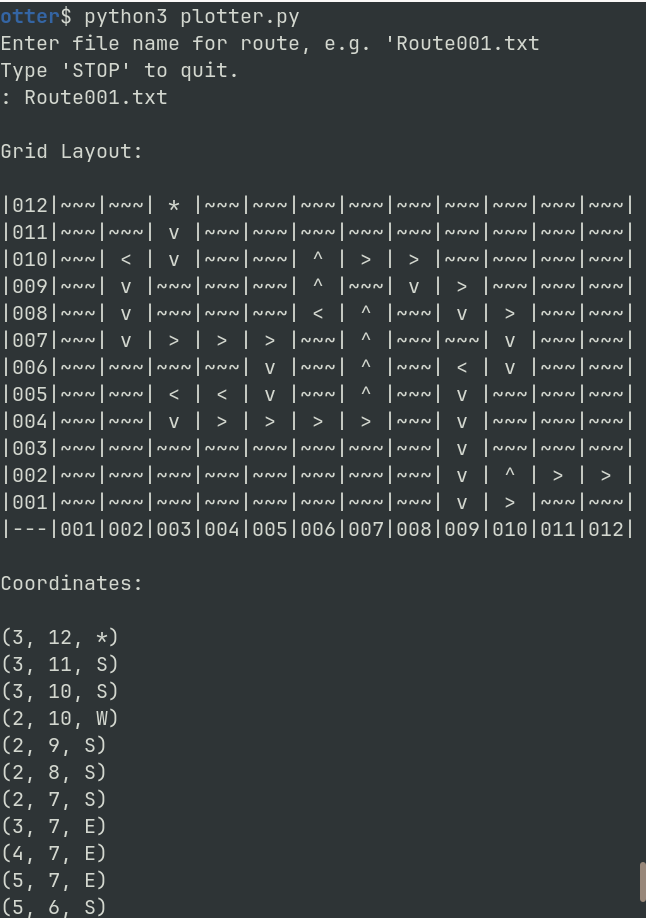
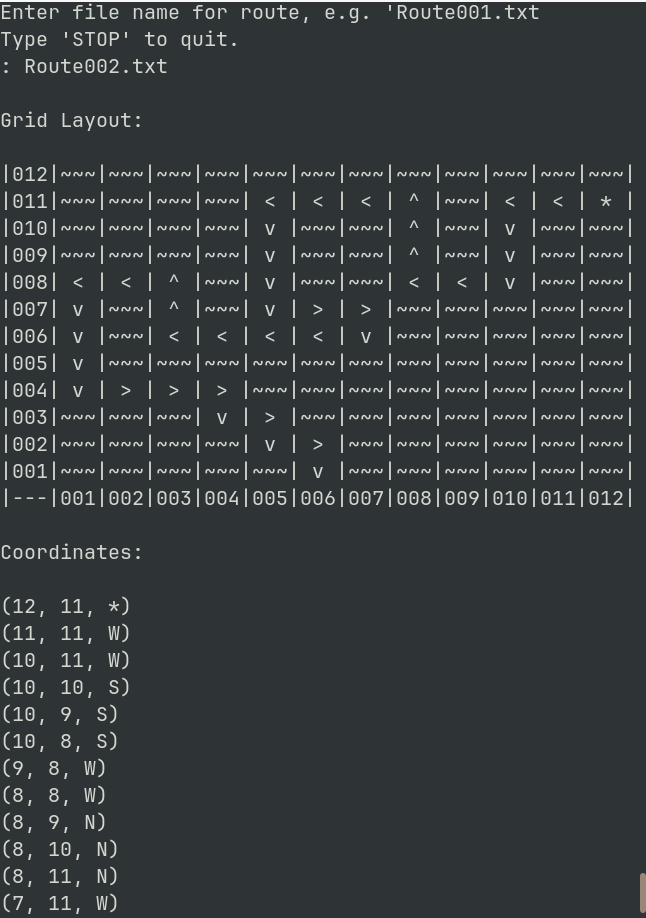
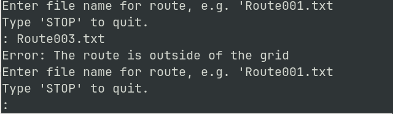

# Route Plotter
This is a route plotter script written for the JHUB coding scheme module 3 written in python.

## What Does it Do?
Reads text files, prints a grid with a route along with coordinates.

## Use
- Download zip folder
- Unzip on local machine
- Ensure python3 is installed
- Enter terminal window
- `python3 plotter.py`
- Ensure that .txt route files are in the same folder as plotter.py

## Thanks for Reading!
